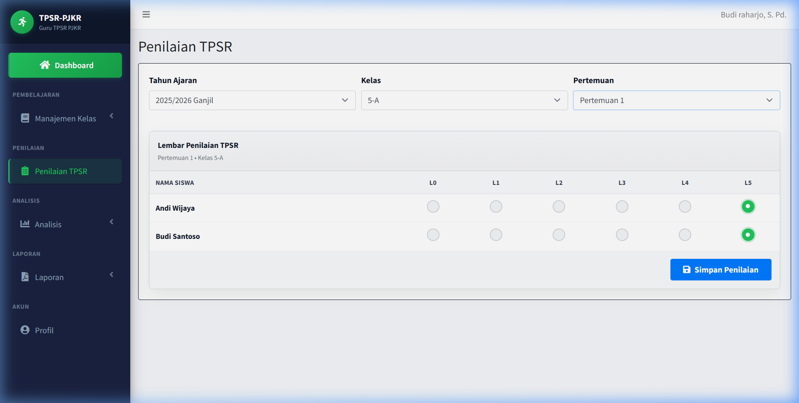

# Panduan Penggunaan Fitur Penilaian TPSR

Fitur Penilaian TPSR (*Teaching Personal and Social Responsibility*) digunakan oleh Guru untuk memberikan penilaian terhadap tingkat tanggung jawab pribadi dan sosial siswa pada setiap pertemuan. 

Berikut adalah panduan lengkap cara penggunaan fitur ini:

---

## 1. Mengakses Halaman Penilaian TPSR
Setelah masuk (login) ke aplikasi:
1. Perhatikan menu sidebar sebelah kiri.
2. Klik menu **Penilaian TPSR** (menu tunggal tanpa sub-menu).
3. Anda akan diarahkan ke halaman pengisian lembar penilaian TPSR.

---

## 2. Memilih Filter Penilaian
Sebelum lembar penilaian ditampilkan, Anda wajib memilih kombinasi filter di bagian atas halaman:
1. **Tahun Ajaran**: Pilih tahun ajaran yang aktif (misalnya `2025/2026 Ganjil`).
2. **Kelas**: Pilih kelas siswa yang ingin dinilai (misalnya `5-A`).
3. **Pertemuan**: Pilih pertemuan ke berapa penilaian ini dilakukan (pertemuan `1` hingga `16`).

> [!TIP]
> **Pembaruan Filter Cepat**: Jika Anda sudah memilih pertemuan lalu mengubah pilihan kelas, daftar siswa akan **langsung ter-update** untuk kelas yang baru tanpa mereset pilihan pertemuan Anda.

---

## 3. Lembar Penilaian & Nilai Default L5
Setelah filter lengkap, lembar penilaian akan muncul:

### Ketentuan Pengisian Level:
- **Default L5**: Untuk efisiensi pengisian, sistem secara default akan mencentang level **L5** untuk seluruh siswa pada pertemuan yang baru dibuka.
- **Dua Kondisi Perpindahan Pertemuan**:
  1. Jika Anda berpindah ke **pertemuan baru yang belum dinilai**, semua pilihan radio button akan kembali ke **L5** secara default (tidak mengikuti data pertemuan sebelumnya).
  2. Jika Anda berpindah ke **pertemuan yang sudah memiliki data penilaian di database**, sistem akan memuat data asli yang tersimpan sebelumnya dari database.

---

## 4. Indikator Status Penilaian
Untuk mempermudah membedakan antara pertemuan yang baru dibuka (masih menggunakan nilai default L5) dan pertemuan yang sudah benar-benar dinilai dan disimpan ke database, terdapat **Badge Status** di pojok kanan atas tabel penilaian:

-  **Belum Dinilai (Abu-abu)**: Pertemuan ini belum pernah disimpan ke database. Nilai L5 yang tampil adalah nilai default.
-  **Sudah Dinilai (Hijau)**: Pertemuan ini sudah pernah disimpan ke database dan menampilkan data riil.

---

## 5. Menyimpan Penilaian & Perhitungan Rata-rata Poin
1. Setelah menyesuaikan level tanggung jawab siswa (L0 s.d L5), klik tombol **Simpan Penilaian** di bawah tabel.
2. Setelah sukses disimpan, sistem akan memproses hal berikut:
   - Menyimpan seluruh record penilaian siswa ke database.
   - Mengubah status indikator menjadi **Sudah Dinilai** (Hijau).
   - **Auto-Kalkulasi Rata-rata**: Menghitung ulang rata-rata poin tanggung jawab masing-masing siswa berdasarkan seluruh pertemuan yang sudah memiliki penilaian (L0 bernilai 0, hingga L5 bernilai 5) dan memperbarui kolom **Rata-rata Poin** pada halaman **Data Siswa**.
